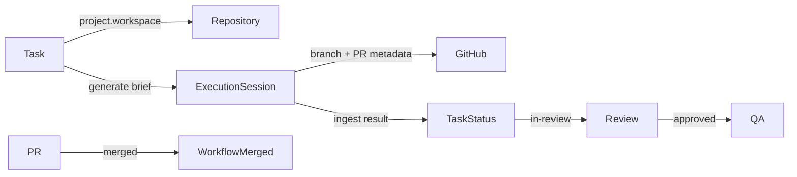

# GitHub Workflow Foundation

Engineering OS Platform v2 milestone: safe, traceable Git workflow for agent-driven implementation.

## Scope

| Capability | Implementation |
| --- | --- |
| Repository context on tasks | Resolved from project workspace repositories via `task-repository-context.ts` |
| Branch naming | Deterministic `feature/{taskId}-{slug}` via `deriveBranchName()` |
| Protected branches | Blocked by `isProtectedBranch()` and repository guardrails |
| Validation commands | Exposed through check command profiles in repository task context |
| Session ↔ branch/PR link | `ExecutionSession` fields: `branchName`, `baseBranch`, `commitSha`, `prUrl`, `prNumber`, `prStatus`, `mergeStatus` |
| Workflow visibility | Task detail shows **Planned → Running → Reviewed → Merged** stepper |

## Data flow



## Repository-safe task context

`generateRepositoryTaskContext()` (MUS-153) produces truthful metadata for agents:

- Repository name, URL, stack, analysis status
- Intended branch and base branch
- Validation commands from check command profiles
- Warnings when metadata is missing or analysis incomplete

Implementation briefs embed this via `formatRepositoryTaskContext()` so agents receive one canonical context block.

## Branch and PR tracking

When an execution session is prepared:

1. Branch name is derived and stored on the session.
2. The worker checks out the repository at that branch.
3. On result ingestion (manual form or worker), optional PR fields are recorded:
   - `commitSha`, `prUrl`, `prNumber`, `prStatus`, `mergeStatus`

Protected patterns (`main`, `master`, `release/*`) are rejected unless `isHotfix` is set on session creation.

## UI

### Task detail (`/work/tasks/[id]`)

- **GitHub Workflow** — four-phase progress derived from task status, session status, review outcome, and PR merge state.
- **Repository Context** — validation commands, branch target, warnings, link to repository intelligence.
- **Branch & Pull Request** — live branch/PR metadata from the active or latest completed session.

### Execution result form

Optional Git fields when recording agent output manually: commit SHA, PR URL, PR number, PR status.

## Related tickets

- MUS-152 — Branch and PR tracking on execution sessions
- MUS-153 — Repository-safe task context generator
- MUS-186 — Repository guardrails for worker file changes

## Validation

```bash
npm run test
```

Key test files:

- `src/lib/github-workflow-status.test.ts`
- `src/lib/repository-task-context.test.ts`
- `src/lib/implementation-brief.test.ts`
- `src/lib/execution-session-service.test.ts`
